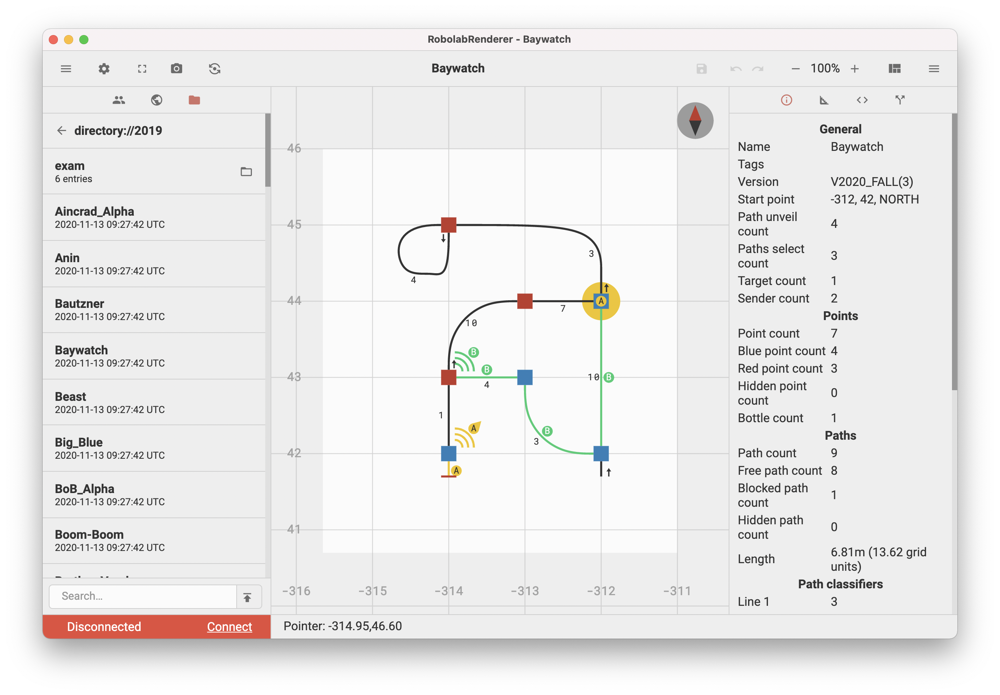

# RobolabRenderer

Render engine, editor and tracker for planets and robots. 



## Features

- Render and animate planets
- Support for textual and graphical editing of planets
- Track single robots or all robot that currently use the same planet
- Multiplatform and web support

## Native client

Run electron:
```shell script
./gradlew runElectron
```

Update ui without restart:
```shell script
./gradlew deployElectron
```

Package electron to executable:
```shell script
./gradlew packElectron
```

To customize the electron build process change to the electron directory:
```shell script
./gradlew deployElectron

cd electron
yarn install

# Run the development version
yarn dev

# Build release version for the current architecture and os
npx electron-builder build
```

## Web client

### Variant 1 - Run inside docker

Use the provided Dockerfile and docker-compose file to build and and run the whole project in one step:
```shell script
docker-compose up
```

### Variant 2 - Run nativly

Build the frontend:
```shell script
./gradlew deployWeb
```

Build and run the backend. The default address is http://localhost:8080/.
You will need a running redis instance:
```shell script
./gradlew runBackend
```
